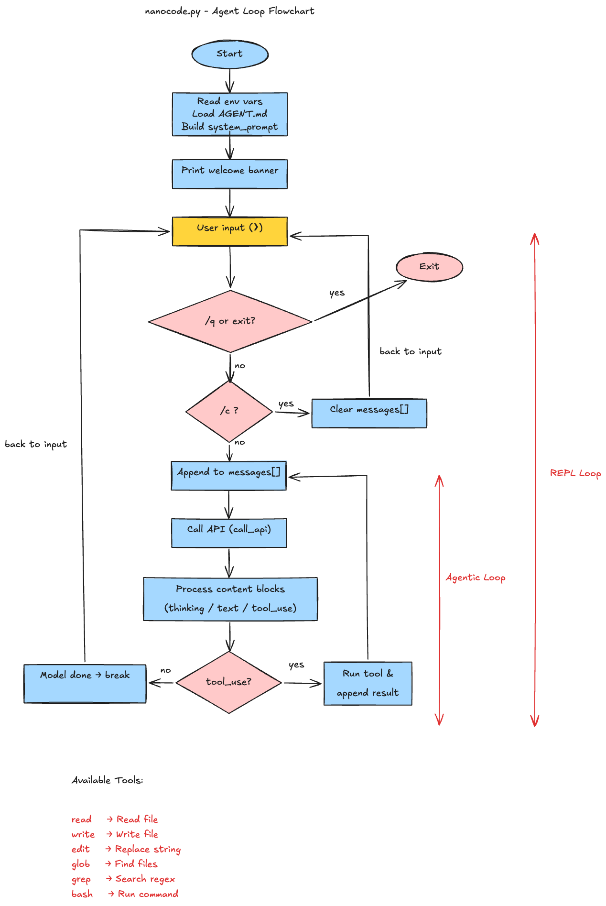
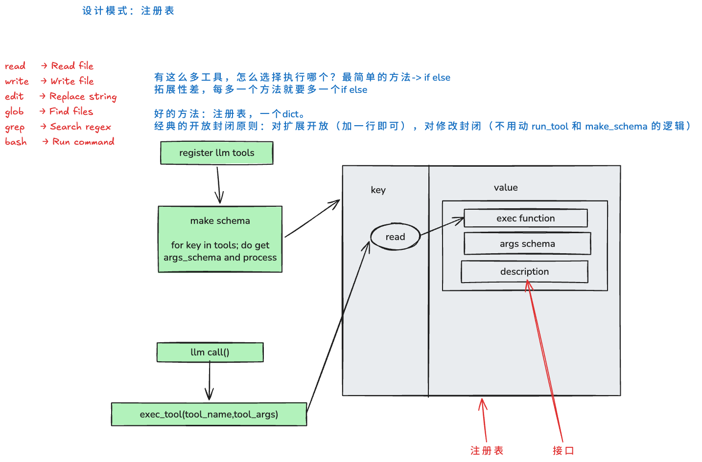

最近花了一些时间精读了一个玩具项目 nanocode——一个不到 270 行、零依赖的 Python 单文件，完整复刻了 Claude Code 的核心架构：**agentic loop + tool use**。这篇文章是我的理解笔记，重点不是"它实现了什么"，而是"它的每个设计决策背后在权衡什么"。

<!-- truncate -->



## 这个项目是什么

nanocode 是一个极简的终端编程助手，只有一个文件 `nanocode.py`，只用 Python 标准库（`urllib`、`json`、`subprocess`、`glob`、`re`、`os`），没有任何第三方依赖。它能做的事情和 Claude Code 一样：

- 读取你的输入
- 调用 LLM（Anthropic API 或 OpenRouter 代理）
- 执行模型请求的工具调用（read / write / edit / glob / grep / bash）
- 把结果回传给模型，循环往复，直到模型认为任务完成

整个项目最核心的循环只有十几行，但它揭示了一个重要事实：**一个"能用"的 AI coding agent，本质上就是 API 调用 + 一个 while 循环 + 几个工具函数**。

## 核心架构：agentic loop

先把术语理清。所谓 agentic loop，就是"模型反复调用工具直到不再产生 tool_use 请求"的循环。nanocode 里它长这样（`nanocode.py` 内层 `while True`）：

```
用户输入
  │
  ▼
messages.append({"role": "user", ...})
  │
  ▼
┌─ agentic loop ─────────────────────────┐
│ call_api(messages)                     │
│   ↓                                    │
│ 解析 response 的 content blocks:       │
│   text      → 打印给人类看             │
│   tool_use  → 执行工具，收集结果       │
│   ↓                                    │
│ 有 tool_use?                           │
│   是 → tool_result 作为 user 消息回传  │
│        继续循环                        │
│   否 → 退出循环，回到 REPL 等待输入    │
└────────────────────────────────────────┘
```

1. **assistant 的 content 是 block 列表**，可以同时包含 text 和多个 tool_use，不是纯字符串。
2. **退出条件是"没有 tool_use"**，而不是"模型说完了"。模型完全可以在输出一段文字之后又请求工具，所以循环判断的是 block 类型，不是文本内容。

源码里对应的退出判断非常朴素：

```python
if not tool_results:
    break
messages.append({"role": "user", "content": tool_results})
```

## 工具注册表设计w模式

nanocode 的六个工具用一个字典注册，这是整个项目里我最喜欢的结构（`nanocode.py` TOOLS 字典）：

```python
TOOLS = {
    "read": (
        "Read file with line numbers (file path, not directory)",
        {"path": "string", "offset": "number?", "limit": "number?"},
        read,
    ),
    ...
}
```

每个工具是一个三元组：`(description, schema, function)`。这个设计带来两个好处：

**新增工具的成本是加一行字典项。** `make_schema()` 会自动把简写 schema（`"number?"` 里的 `?` 表示可选参数）转换成 Anthropic API 要求的 JSON Schema；`run_tool()` 通过名字查表执行。描述、接口、实现三者集中在一处，不存在"加了函数忘了注册"的问题。

**schema 是给人写的，也是给模型写的。** description 会直接出现在 API 请求的 tools 字段里，成为模型判断"该不该用、怎么用"这个工具的依据。所以这些一句话描述实际上是 prompt engineering 的一部分。



## 工具实现里的设计权衡

逐一看六个工具，每个都能学到一个针对 LLM 的设计决策。这些决策和"给人用的 CLI 工具"的思路很不一样。

### read：1-based 行号

```python
selected = lines[offset : offset + limit]
return "".join(f"{offset + idx + 1:4}| {line}" for idx, line in enumerate(selected))
```

内部用 0-based 索引切片，输出时显示 1-based 行号。这是刻意对齐 `cat -n` 和 Claude Code 的 Read 工具的约定——**模型在训练数据里见过的行号格式，就是它最不容易出错的格式**。

### bash：流式输出 + 30 秒硬超时

bash 工具用 `select.select` 轮询子进程输出，每读一行就实时打印到终端（前缀 `│`），而不是等命令结束一次性返回。这样用户能看到长命令的进度。30 秒是硬编码的超时——够大多数构建和测试用，又不会让 REPL 永久卡住。

### 错误处理：把异常还给模型

```python
def run_tool(name, args):
    try:
        return TOOLS[name][2](args)
    except Exception as err:
        return f"error: {err}"
```

工具出错不抛异常，而是把错误信息转成字符串作为 tool_result 回传。**这让模型有机会看到错误原因并自行修正**（比如路径写错了就换个路径），而不是直接打断对话。整个项目的错误处理分三层：

| 层级 | 位置 | 行为 |
|------|------|------|
| 工具层 | `run_tool()` | 异常转字符串，交给 LLM 自己处理 |
| API 层 | `call_api()` | 没有 try，HTTP 错误直接向上抛 |
| REPL 层 | `main()` 外层 | 兜底捕获，打印错误继续循环 |

## 零依赖的代价与收获

`call_api()` 用的是标准库的 `urllib.request`，这意味着：没有连接池、没有重试、没有超时参数、没有流式响应（`"stream": False`）。一次请求就是一个阻塞的 HTTP 调用。

这在生产代码里不可接受，但对学习项目来说反而是优点——**API 请求的全部细节都摊开在 20 行代码里**：messages 怎么构造、tools schema 长什么样、`x-api-key` header 怎么放（注意 Anthropic 用的是 `x-api-key` 而不是常见的 `Authorization: Bearer`）。想理解 Messages API，读这个函数比读官方 SDK 的层层封装快得多。

## 动手实验：AGENT.md 记忆

为了验证自己真的读懂了，我加了一个小功能：启动时如果当前目录存在 `AGENT.md`，就把内容注入 system prompt：

```python
agent_md = ""
if os.path.exists("AGENT.md"):
    agent_md = open("AGENT.md").read()
system_prompt = f"Concise coding assistant. cwd: {os.getcwd()}"
if agent_md:
    system_prompt += f"\n\n{agent_md}"
```

## 我学到的东西

读完这 270 行，我对 AI coding agent 的几个祛魅时刻：

1. **Agent 没有魔法。** 核心就是"调 API → 执行工具 → 结果回传"的循环。真正的复杂度都在工程细节里：上下文管理、错误恢复、权限控制、UI 反馈——nanocode 把这些全砍了，所以只剩 270 行。
2. **工具是为模型设计的，不是为人。** 输出要限量、行号要符合训练数据里的惯例、失败要给模型重试的机会而不是替它做决定。
3. **注册表模式让工具系统可扩展。** 描述、schema、实现三合一，是 function calling 系统最自然的组织方式。

## 参考

- nanocode 源码与官方文档：[Anthropic Messages API - Tool Use](https://docs.anthropic.com/en/docs/agents-and-tools/tool-use/overview)
- 本文的配图来自项目 `docs/` 目录下的手绘流程图
